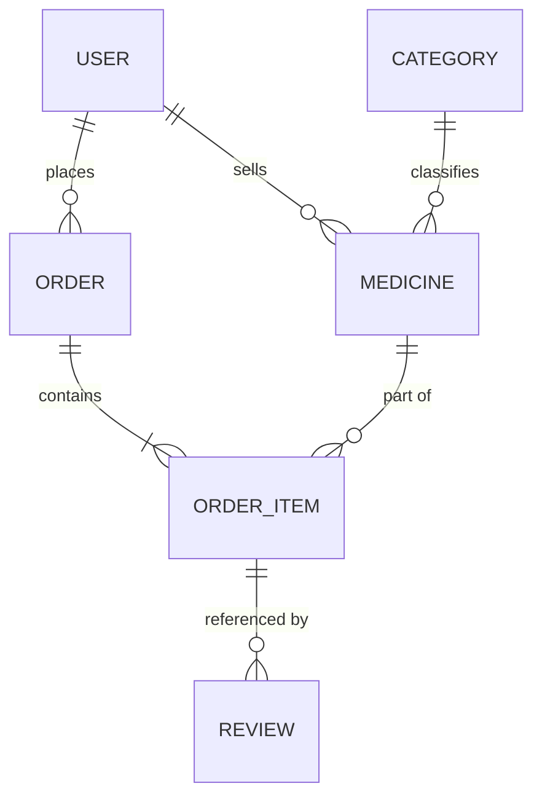

# ⚙️ Pharmetix Backend (MediStore API)

[](https://nodejs.org/)
[](https://expressjs.com/)
[](https://www.postgresql.org/)
[](https://www.prisma.io/)

The architectural backbone of the Pharmetix marketplace. This server handles secure authentication, transactional medicine management, and complex role-based access control (RBAC).

---

## 📖 Table of Contents

1.  [Technical Core](#-technical-core)
2.  [Database Architecture](#-database-architecture)
3.  [Modular System Design](#-modular-system-design)
4.  [Security & Authentication](#-security--authentication)
5.  [Key API Modules](#-key-api-modules)
6.  [Setup & Deployment](#-setup--deployment)

---

## 🚀 Technical Core

- **Runtime**: Node.js 20+ with ES Modules.
- **Engine**: Express 5 (Next Generation) for high-performance routing.
- **ORM**: Prisma 7 with a multi-file schema architecture for better organization.
- **Validation**: Zod-powered request body and query validation.
- **Error Handling**: Centralized asynchronous error wrapper for clean, boilerplate-free controllers.

---

## 🗄️ Database Architecture

The system uses a highly relational PostgreSQL schema designed for integrity and auditing.

### Entities & Relationships

- **Users**: Extended with Custom Roles (Customer, Seller, Admin) and Status (Active, Banned).
- **Medicines**: Linked to Categories and Sellers. Tracks pricing, generic names, and deep metadata.
- **Orders**: A complex relationship model linking Customers, Sellers, and individual OrderItems.
- **Reviews**: Purchase-locked entities that validate user ownership before creation.



---

## 🛠️ Modular System Design

The codebase follows a specialized **Module-Based Pattern** to prevent technical debt:

```text
src/
├── config/             # Environment & Singleton configs (Env, Database)
├── lib/                # Shared utilities and SDK initializations
├── middlewares/        # Security, Auth, and Error handlers
├── modules/            # Core Business Logic (Domain Driven)
│   ├── user/           # Admin user management & profile logic
│   ├── medicine/       # Inventory CRUD & stock logic
│   ├── order/          # Transactional order processing
│   ├── category/       # Taxonomy management
│   └── review/         # Customer feedback logic
└── server.ts           # Entry point
```

---

## 🔐 Security & Authentication

- **Better Auth**: Handles enterprise-grade session management and email/password flows.
- **RBAC Middleware**: A granular `requireAuth` middleware that enforces role-based constraints at the route level.
- **Database Shields**: Prisma transactions ensure that complex operations (like order placements) are atomic—either they all succeed, or none do.

---

## 📡 Key API Modules

### Medicine Management

- `GET /api/medicines`: Optimized public search with category and price filters.
- `POST /api/medicines`: (Seller Only) Create new inventory items.
- `PATCH /api/medicines/:id`: (Seller Only) Update details or handle **Atomic Stock Operations**.

### Transactional Orders

- `POST /api/orders`: Securely handles cart checkout and creates relational order items.
- `PATCH /api/orders/item/:id/status`: (Seller Only) Allows pharmacists to update specific shipment statuses.

### Global Admin

- `GET /api/users`: (Admin Only) View all ecosystem participants.
- `PATCH /api/users/:id/status`: (Admin Only) Execute bans or account reactivations.

---

## 🛠️ Setup & Deployment

### Environment Configuration

Create a `.env` file from the provided template:

```env
# Server
PORT=5000
NODE_ENV="development"

# Database
DATABASE_URL="your_neon_postgresql_connection_string"

# Auth
BETTER_AUTH_SECRET="your_generated_secret"
BETTER_AUTH_URL="http://localhost:3000" # Client URL

# Seed Admin
APP_ADMIN_EMAIL="admin@example.com"
APP_ADMIN_PASS="secure_password"
```

### Quick Commands

```bash
pnpm install            # Install dependencies
pnpm prisma:generate    # Generate Prisma Client
pnpm prisma:migrate     # Sync DB schema
pnpm admin:seed         # Setup initial system admin
pnpm dev                # Start high-speed tsx engine
```

---

**Built for scalability and precision.**
